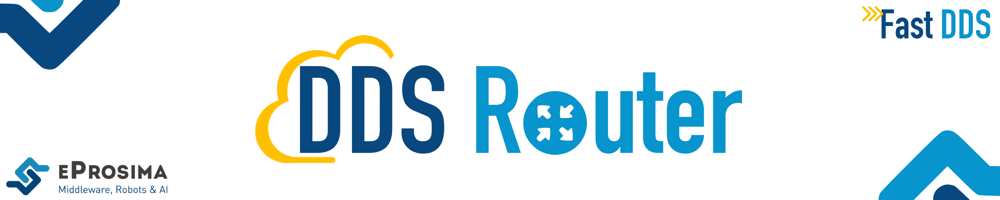
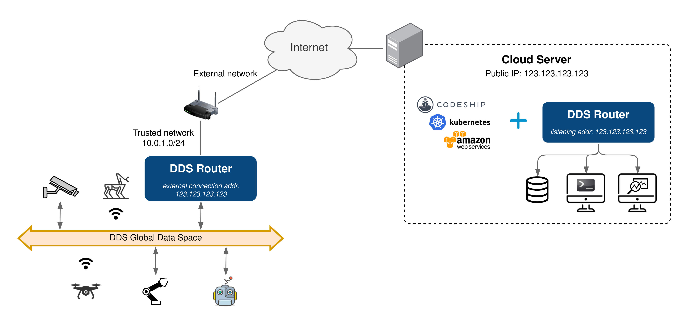

 

    <strong>
        <a href="https://eprosima.com/index.php/downloads-all">Download</a>
        &nbsp;&nbsp;•&nbsp;&nbsp;
        <a href="https://eprosima-dds-router.readthedocs.io/en/latest/">Docs</a>
        &nbsp;&nbsp;•&nbsp;&nbsp;
        <a href="https://eprosima.com/index.php/company-all/news">News</a>
        &nbsp;&nbsp;•&nbsp;&nbsp;
        <a href="https://x.com/EProsima">X</a>
        &nbsp;&nbsp;•&nbsp;&nbsp;
        <a href="mailto:info@eprosima.com">Contact Us</a>
    </strong>

  

    
    
    
    
    
     
    
    
    
    

  

*eProsima DDS Router* is an end-user software application that enables the connection of distributed DDS networks.
That is, DDS entities such as publishers and subscribers deployed in one geographic location and using a dedicated
local network will be able to communicate with other DDS entities deployed in different geographic areas on their own
dedicated local networks as if they were all on the same network through the use of *eProsima DDS Router*.
This is achieved by deploying a *DDS Router* on an edge device of each local network so that the
*DDS Router* routes DDS traffic from one network to the other through WAN communication.

Furthermore, *DDS Router* is a software designed for various forms of distributed networks,
such as mesh networks in which nodes are deployed in different private local networks that are auto-discovered
without any centralized network node, or cloud-based networks where there is a data processing cloud and
multiple geographically distributed edge devices.

Following are some of the key features of *eProsima DDS Router*:

* **WAN communication over TCP**: it supports WAN over TCP communication to establish DDS communications over the
  Internet.
* **Distributed nature**: the user may deploy intermediate *DDS Router* nodes to discover new entities that enter and
  leave the network dynamically.
* **Efficient data routing**: *DDS Router* avoids data introspection achieving a zero-copy system in data
  forwarding.
* **Easy deployment**: it is based on an easily configurable modular system for users with no knowledge of computer
  networks.
* **Topic allowlisting**: it is possible to configure a *DDS Router* to forward just the user data belonging to a
  topic specified by the user.
* **Dynamic topic discovery**: the user does not need to fully specify over which topics to communicate (i.e. provide
  concrete topic names and types). The discovery of topics matching the allowlisting rules automatically triggers the
  creation of all entities required for communication.

## Commercial support

Looking for commercial support? Write us to info@eprosima.com

Find more about us at [eProsima’s webpage](https://eprosima.com/).

## Documentation

You can access the documentation online, which is hosted on [Read the Docs](https://eprosima-dds-router.readthedocs.io).

* [Introduction](https://eprosima-dds-router.readthedocs.io/en/latest/rst/formalia/titlepage.html)
* [Getting Started](https://eprosima-dds-router.readthedocs.io/en/latest/rst/getting_started/project_overview.html)
* [Installation Manual](https://eprosima-dds-router.readthedocs.io/en/latest/rst/developer_manual/installation/sources/linux.html)
* [User Manual](https://eprosima-dds-router.readthedocs.io/en/latest/rst/user_manual/user_interface.html)
* [Examples](https://eprosima-dds-router.readthedocs.io/en/latest/rst/examples/echo_example.html)
* [Use Cases](https://eprosima-dds-router.readthedocs.io/en/latest/rst/use_cases/ros_cloud.html)
* [Developer Manual](https://eprosima-dds-router.readthedocs.io/en/latest/rst/developer_manual/installation/sources/linux.html)
* [Release Notes](https://eprosima-dds-router.readthedocs.io/en/latest/rst/notes/notes.html)
